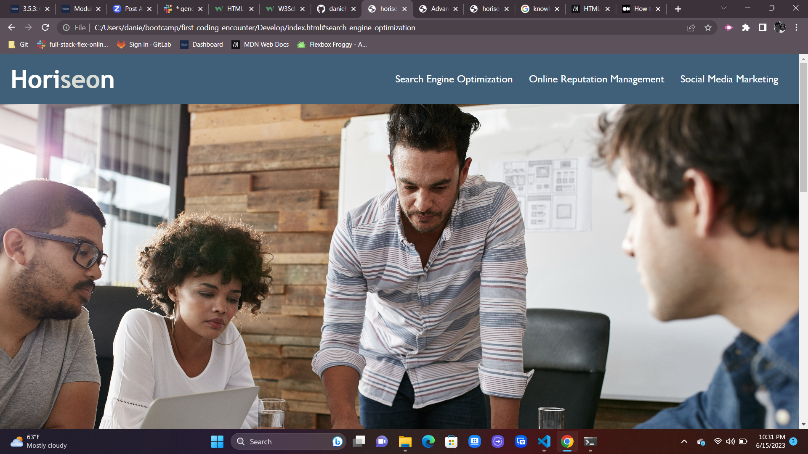

# <First-coding-encounter>

## Description

The goal was to optimize and refactor  the webpage for 'horiseon'. I built this project to work and expand my coding knowleadge with HTML and CSS. In this process, I learned to improve a pre existing code. 

## Table of Contents (Optional)

If your README is long, add a table of contents to make it easy for users to find what they need.

- [Installation](#installation)
- [Usage](#usage)
- [Credits](#credits)
- [License](#license)

## Installation

N/A. This is a website which is accessible with internet connection an a browser navigator. 

## Usage

User are able to interact with horiseon's website by selecting the titles in the navigation section, which will take the user to their respective paragraphs on the body of the webpage. To find accessible alt atributes, user can open the Chrome DevTools by pressing Command+Option+I (macOS) or Control+Shift+I (Windows). A console panel should open either below or to the side of the webpage in the browser. There you will see a description of the websites images. 

## Credits

https://www.w3schools.com/html/html5_semantic_elements.asp

## License

Please refer to the license in the repo.

